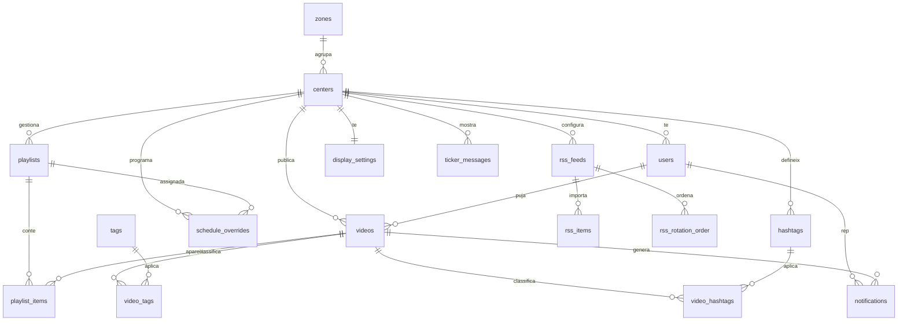

# PUBLI*CAT

**PUBLI*CAT** és una plataforma web multi-centre per gestionar, organitzar i mostrar contingut audiovisual educatiu. Permet als centres treballar amb vídeos de Vimeo, llistes de reproducció, feeds RSS i pantalles informatives amb control de rols i permisos.

Aquest README és la porta d'entrada humana al projecte: estat general, posada en marxa, estructura del repositori i mapa resum de la base de dades. Les regles operatives per a agents són a `AGENTS.md`.

## Fonts Principals

- `AGENTS.md`: guia operativa canònica per treballar al repo.
- `MEMORIA_PROJECTE.md`: registre datat de verificacions, rectificacions i decisions recents.
- `docs/database.schema.md`: estructura i relacions canòniques de la base de dades.
- `supabase/migrations/`: historial SQL versionat.
- `docs/`: documentació funcional, tècnica i UI.

Els documents històrics o d'auditoria antiga poden contenir informació superada. Quan hi hagi dubtes, prevalen `AGENTS.md`, `MEMORIA_PROJECTE.md`, `docs/database.schema.md`, les migracions i la BD real verificada.

## Estat Actual

El projecte ja disposa dels blocs principals implementats:

- Administració global de centres, zones i usuaris.
- Autenticació amb Supabase Auth, invitacions i recuperació de contrasenya.
- Gestió de vídeos amb URL de Vimeo i pujada directa a Vimeo via Tus.
- Moderació de vídeos pujats per alumnes, incloent retorn a revisió.
- Tags globals, hashtags de centre, filtres i compartició intercentres.
- Llistes de reproducció amb drag and drop i calendari d'assignacions.
- Mode pantalla/display amb vídeo principal, anuncis, ticker i RSS.
- Gestió de feeds RSS, configuració i ordre de rotació.
- Landing pública amb playlist global.
- Gestió d'usuaris del centre per part d'editors professor.

## Stack

- **Framework:** Next.js 16, App Router, Turbopack
- **Llenguatge:** TypeScript
- **UI:** React 19, Tailwind CSS 4, lucide-react
- **Base de dades:** Supabase PostgreSQL amb RLS
- **Auth:** Supabase Auth i `@supabase/ssr`
- **Video:** Vimeo API, `@vimeo/player`, `tus-js-client`
- **RSS:** `rss-parser`
- **Drag and drop:** `@dnd-kit`
- **Deploy:** Vercel

## Requisits

- Node.js 20+
- npm
- Projecte Supabase configurat
- Token de Vimeo amb scopes `private`, `upload`, `video_files`, `public`
- Projecte Vercel per producció

## Posada en Marxa

Instal·la dependències:

```bash
npm install
```

Copia `.env.example` a `.env.local` i omple els valors:

```env
NEXT_PUBLIC_SUPABASE_URL=...
NEXT_PUBLIC_SUPABASE_ANON_KEY=...
SUPABASE_SERVICE_ROLE_KEY=...
DATABASE_URL=...
VIMEO_ACCESS_TOKEN=...
CRON_SECRET=...
MAX_VIDEO_SIZE_MB=2048
ALLOWED_VIDEO_FORMATS=mp4,mov,avi,mkv,webm
VIMEO_UPLOAD_CHUNK_SIZE_MB=10
```

Executa el servidor de desenvolupament:

```bash
npm run dev
```

Obre `http://localhost:3000`.

## Scripts

```bash
npm run dev      # Servidor de desenvolupament
npm run build    # Build de producció
npm run start    # Servidor de producció
npm run lint     # ESLint
```

Actualment no hi ha una suite de tests automatitzada definida. Per canvis de codi, com a mínim executa `npm run lint`; per canvis d'abast mitjà o alt, executa també `npm run build`.

## Estructura del Projecte

```text
app/
  api/                 Endpoints JSON de l'aplicació
  admin/               Administració global
  auth/                Callbacks i fluxos d'autenticació
  components/          Components UI, layout, vídeos, playlists, RSS i display
  contingut/           Gestió de vídeos
  dashboard/           Entrada autenticada
  llistes/             Gestió de llistes de reproducció
  login/               Inici de sessió
  pantalla/            Mode display/pantalla
  perfil/              Perfil d'usuari
  reset-password/      Recuperació de contrasenya
  rss/                 Gestió de feeds RSS
  usuaris/             Gestió d'usuaris del centre
  visor/               Previsualització de pantalla

hooks/                 Hooks de React reutilitzables
lib/                   Lògica compartida, Vimeo, hashtags i display
public/                Logos i assets públics
supabase/migrations/   Migracions SQL versionades
utils/supabase/        Clients Supabase server/client i auth helpers
docs/                  Documentació funcional, tècnica i UI
```

## Base de Dades

El projecte Supabase és `tvsafusrasfzubiujavk` (`publicat_videos`). A data 2026-07-09, `MEMORIA_PROJECTE.md` registra 35 migracions locals i 35 versions registrades a `supabase_migrations.schema_migrations`.

La font canònica de l'estructura i relacions és `docs/database.schema.md`; el SQL exacte és a `supabase/migrations/`.

Taules principals:

- Multi-tenant i usuaris: `zones`, `centers`, `users`, `guest_access_links`, `audit_logs`.
- Vídeos i classificació: `videos`, `tags`, `hashtags`, `video_tags`, `video_hashtags`, `notifications`.
- Llistes i pantalla: `playlists`, `playlist_items`, `schedule_overrides`, `display_settings`, `ticker_messages`.
- RSS: `rss_feeds`, `rss_items`, `rss_center_settings`, `rss_rotation_order`.

Relacions principals:



Principis de BD:

- Totes les taules públiques principals han de tenir RLS.
- Les decisions d'autorització server-side han de llegir rol i centre de `public.users`, no de `user_metadata`.
- `videos.zone_id` es deriva del centre.
- Els vídeos d'alumnes entren com `pending_approval`; `needs_revision` representa retorn a correcció.
- La landing pública només ha de mostrar vídeos `published`, compartits i dins la playlist global corresponent.

## Rols

- `admin_global`: control global del sistema, centres, zones, usuaris, llistes globals i landing.
- `editor_profe`: gestiona vídeos, llistes, RSS i usuaris del seu centre.
- `editor_alumne`: pot pujar vídeos pendents d'aprovació i editar items de llistes marcades com editables per alumnes.
- `display`: accedeix al mode passiu de pantalla.

Els permisos s'han de mantenir alineats entre UI, API routes i RLS. No n'hi ha prou amb amagar controls a la interfície.

## Fluxos Principals

### Vídeos

- Alta per URL de Vimeo amb validació i metadades.
- Pujada directa a Vimeo amb Tus i seguiment de processament.
- Guardat de `vimeo_id` i `vimeo_hash` per vídeos unlisted.
- Tags globals obligatoris i hashtags opcionals per centre.
- Compartició intercentres controlada per editors professor i admin global.

### Moderació

- Els vídeos pujats per `editor_alumne` entren com `pending_approval`.
- `editor_profe` i `admin_global` poden aprovar, editar, rebutjar o demanar revisió.
- Les notificacions existeixen a nivell de base de dades; la UI de notificacions queda com a millora.

### Llistes i Pantalla

- Les llistes agrupen vídeos ordenats.
- Hi ha llista permanent, llistes per dia de la setmana, llistes amb calendari, anuncis i globals.
- El calendari (`schedule_overrides`) permet assignar llistes a dates concretes i passa per sobre del mode habitual.
- El mode display combina vídeo principal, anuncis, ticker i RSS.

### RSS

- Gestió de feeds per centre.
- Validació de feeds.
- Configuració de durada per item/feed i ordre de rotació.
- Actualització via endpoint cron protegit amb `CRON_SECRET`.

## Migracions

Les migracions viuen a `supabase/migrations/`. Abans de fer canvis de schema, RLS, triggers, indexes o Storage, segueix el flux segur descrit a `AGENTS.md`: verificar projecte Supabase, comprovar migracions locals/remotes, fer `dry-run` quan s'apliqui amb CLI i registrar decisions importants a `MEMORIA_PROJECTE.md`.

No editis migracions antigues que representin historial ja aplicat.

## Documentació de Referència

- `AGENTS.md`: guia operativa per a agents i mantenidors.
- `MEMORIA_PROJECTE.md`: memòria de verificacions i decisions.
- `docs/database.schema.md`: estructura i relacions de base de dades.
- `docs/overview.md`: visió general del producte.
- `docs/domain-model.md`: model de domini.
- `docs/roles.md`: rols i permisos.
- `docs/authentication.md`: autenticació.
- `docs/moderation-system.md`: moderació de vídeos d'alumnes.
- `docs/vimeo-integration.md`: integració amb Vimeo.
- `docs/rss-system.md`: sistema RSS.
- `docs/storage.md`: Storage actual verificat.
- `docs/ui/guia-estil.md`: guia visual.
- `docs/ui/pantalles.md`: pantalles principals i navegació.

Els documents de `docs/OBSOLET/` són útils com a historial, però no s'han d'usar com a estat actual sense verificació.

## UI i Identitat

Colors principals:

- Groc: `#FEDD2C`
- Magenta: `#F91248`
- Turquesa: `#16AFAA`
- Fons clar: `#F9FAFB`
- Text: `#111827`

La UI fa servir Montserrat per títols, Inter per text i icones de `lucide-react`.

## Deploy

Producció:

```text
https://publicat-lovat.vercel.app
```

La branca `main` es desplega automàticament a Vercel. Les variables d'entorn de producció s'han de configurar al dashboard de Vercel.

## Llicència

Projecte intern de Lacenet per a centres educatius.
