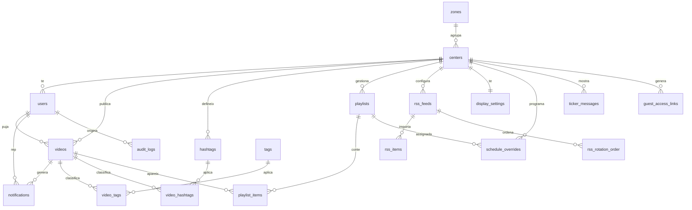

# Esquema de base de dades - PUBLI*CAT

Document canònic del mapa de base de dades de PUBLI*CAT. Descriu l'estructura real verificada, les relacions principals i les regles que cal preservar quan es modifica schema, RLS o fluxos de dades.

Última verificació: 2026-07-16 contra la BD real `publicat_videos` (`tvsafusrasfzubiujavk`) via `DATABASE_URL`, sense exposar credencials.

## Fonts de veritat

- Aquest document és el mapa canònic de lectura per entendre la BD.
- El SQL exacte viu a `supabase/migrations/`.
- Les verificacions i rectificacions datades viuen a `MEMORIA_PROJECTE.md`.
- Els informes antics moguts a `docs/OBSOLET/` són històrics i no s'han d'usar com a foto actual sense contrastar.

Estat verificat el 2026-07-16:

- Taules públiques: 21.
- Enums públics: 7.
- Migracions locals: 42.
- Versions registrades a `supabase_migrations.schema_migrations`: 42.
- Última migració registrada: `20260716120000_video_retention_and_expiration.sql`.
- Totes les taules públiques tenen RLS activat.

## Convencions

- Schema principal: `public`.
- Identificadors: `uuid`.
- Timestamps: `timestamptz`.
- Naming: taules en plural i `snake_case`.
- Multi-tenant principal: `center_id`.
- El rol i centre autoritzadors surten de `public.users`, no de `user_metadata`.
- Les migracions ja aplicades no s'editen; els canvis nous es fan amb una migració nova.

## Enums

```text
user_role:
  admin_global
  editor_profe
  editor_alumne
  display

onboarding_status:
  invited
  active
  disabled

video_type:
  content
  announcement

video_status:
  pending_approval
  published
  needs_revision

playlist_kind:
  permanent
  weekday
  announcements
  custom
  global
  landing

display_playlist_mode:
  permanent
  weekday

video_retention_policy:
  end_of_school_year
  indefinite
  custom_date
```

## Relacions Principals



Relacions estructurals destacades:

- `zones.id -> centers.zone_id`.
- `centers.id -> users.center_id`, `videos.center_id`, `hashtags.center_id`, `playlists.center_id`, `rss_feeds.center_id`, `display_settings.center_id`, `schedule_overrides.center_id`, `ticker_messages.center_id`.
- `users.id -> videos.uploaded_by_user_id`, `videos.approved_by_user_id`, `videos.shared_by_user_id`, `videos.rejected_by_user_id`, `notifications.user_id`, `playlist_items.added_by_user_id`, `rss_feeds.created_by_user_id`, `schedule_overrides.created_by_user_id`, `audit_logs.user_id`.
- `videos.id -> playlist_items.video_id`, `notifications.video_id`, `video_tags.video_id`, `video_hashtags.video_id`.
- `playlists.id -> playlist_items.playlist_id`, `schedule_overrides.playlist_id`, `ticker_messages.playlist_id`, `playlists.origin_playlist_id`.
- `rss_feeds.id -> rss_items.feed_id`, `rss_rotation_order.feed_id`.

## Taules i Columnes

Tipus abreujats segons Postgres (`bool`, `int4`, `timestamptz`, `jsonb`). Els defaults, checks, indexes i policies exactes són a les migracions.

```text
audit_logs:
  id uuid not null
  user_id uuid
  action text not null
  entity_type text not null
  entity_id uuid
  details jsonb
  ip_address text
  created_at timestamptz not null

centers:
  id uuid not null
  name text not null
  zone_id uuid not null
  logo_url text not null
  is_active bool not null
  created_at timestamptz not null
  updated_at timestamptz not null

display_settings:
  center_id uuid not null
  show_header bool not null
  show_clock bool not null
  show_ticker bool not null
  ticker_speed int4 not null
  default_playlist_mode display_playlist_mode not null
  standby_message text
  announcement_volume int4 not null
  announcement_mode text not null
  created_at timestamptz not null
  updated_at timestamptz not null

guest_access_links:
  id uuid not null
  token text not null
  center_id uuid not null
  expires_at timestamptz not null
  created_by_user_id uuid
  created_at timestamptz not null
  revoked_at timestamptz

hashtags:
  id uuid not null
  center_id uuid not null
  name text not null
  is_active bool not null
  created_at timestamptz not null
  updated_at timestamptz not null

notifications:
  id uuid not null
  user_id uuid not null
  type text not null
  title text not null
  message text not null
  video_id uuid
  is_read bool not null
  created_at timestamptz not null

media_cleanup_jobs:
  id uuid not null
  video_id uuid not null
  resource_type text not null
  resource_identifier text not null
  status text not null
  attempts int4 not null
  last_error text
  next_attempt_at timestamptz not null
  completed_at timestamptz
  created_at timestamptz not null
  updated_at timestamptz not null

playlist_items:
  id uuid not null
  playlist_id uuid not null
  video_id uuid not null
  position int4 not null
  added_at timestamptz not null
  added_by_user_id uuid

playlists:
  id uuid not null
  center_id uuid
  name text not null
  kind playlist_kind not null
  is_deletable bool not null
  is_student_editable bool not null
  origin_playlist_id uuid
  created_by_user_id uuid
  is_active bool not null
  created_at timestamptz not null
  updated_at timestamptz not null

rss_center_settings:
  center_id uuid not null
  seconds_per_item int4 not null
  seconds_per_feed int4 not null
  refresh_minutes int4 not null
  image_height_percent int4 not null
  updated_at timestamptz not null

rss_feeds:
  id uuid not null
  center_id uuid
  name text not null
  url text not null
  is_active bool not null
  last_fetched_at timestamptz
  last_error text
  created_by_user_id uuid
  is_in_rotation bool not null
  error_count int4 not null
  created_at timestamptz not null
  updated_at timestamptz not null

rss_items:
  id uuid not null
  feed_id uuid not null
  guid text not null
  title text not null
  description text
  link text not null
  pub_date timestamptz
  image_url text
  fetched_at timestamptz not null

rss_rotation_order:
  center_id uuid not null
  feed_id uuid not null
  position int4 not null

schedule_overrides:
  id uuid not null
  center_id uuid not null
  date date not null
  playlist_id uuid not null
  created_by_user_id uuid
  created_at timestamptz not null

tags:
  id uuid not null
  name text not null
  is_active bool not null
  created_at timestamptz not null
  updated_at timestamptz not null

ticker_messages:
  id uuid not null
  center_id uuid not null
  playlist_id uuid
  text text not null
  position int4 not null
  is_active bool not null
  created_at timestamptz not null
  updated_at timestamptz not null

users:
  id uuid not null
  email text not null
  role user_role not null
  center_id uuid
  full_name text
  phone text
  onboarding_status onboarding_status not null
  is_active bool not null
  invited_at timestamptz
  activated_at timestamptz
  created_by_user_id uuid
  last_invitation_sent_at timestamptz
  created_at timestamptz not null
  updated_at timestamptz not null

video_hashtags:
  video_id uuid not null
  hashtag_id uuid not null

video_tags:
  video_id uuid not null
  tag_id uuid not null

videos:
  id uuid not null
  center_id uuid not null
  zone_id uuid
  title text not null
  description text
  type video_type not null
  status video_status not null
  vimeo_url text not null
  vimeo_id text
  vimeo_hash text
  duration_seconds int4
  thumbnail_url text
  frames_urls jsonb not null
  retention_policy video_retention_policy not null
  delete_on date
  uploaded_by_user_id uuid not null
  approved_by_user_id uuid
  approved_at timestamptz
  is_shared_with_other_centers bool not null
  shared_by_user_id uuid
  shared_at timestamptz
  rejection_comment text
  rejected_at timestamptz
  rejected_by_user_id uuid
  is_active bool not null
  created_at timestamptz not null
  updated_at timestamptz not null

zones:
  id uuid not null
  name text not null
  is_active bool not null
  created_at timestamptz not null
  updated_at timestamptz not null
```

## Agrupació Funcional

### Multi-tenant i administració

- `zones`: agrupacions geogràfiques de centres.
- `centers`: tenants principals.
- `users`: perfil aplicatiu 1:1 amb `auth.users`; conté rol, centre i estat d'usuari.
- `guest_access_links`: preparat per accessos temporals; actualment tancat per RLS sense policies.
- `audit_logs`: preparat per auditoria; actualment tancat per RLS sense policies.

### Vídeos i classificació

- `videos`: contingut Vimeo del centre, amb moderació, compartició, metadades Vimeo i `frames_urls` per anuncis/slideshow.
- `videos.retention_policy` controla si el vídeo es conserva fins al 31 de juliol, indefinidament o fins a una data concreta. `delete_on` és l'últim dia inclusiu de conservació.
- `tags`: catàleg global controlat.
- `hashtags`: etiquetes lliures per centre.
- `video_tags`: relació N-M entre vídeos i tags.
- `video_hashtags`: relació N-M entre vídeos i hashtags.
- `notifications`: avisos d'aprovació, rebuig, pendent i revisió associats a usuaris i vídeos.
- `media_cleanup_jobs`: cua privada i durable per eliminar vídeos de Vimeo i fotogrames d'anuncis. No té FK cap a `videos` deliberadament: ha de sobreviure després de l'esborrat local i es processa amb `service_role`.

### Llistes i pantalla

- `playlists`: llistes de tipus `permanent`, `weekday`, `announcements`, `custom`, `global` o `landing`.
- `playlist_items`: vídeos ordenats dins una playlist.
- `schedule_overrides`: assignació d'una playlist a una data concreta per centre; passa per sobre del mode habitual.
- `display_settings`: configuració visual i mode habitual de pantalla (`permanent` o `weekday`) per centre.
- `ticker_messages`: missatges de ticker generals del centre o associats a una playlist `weekday`; el trigger `trg_validate_ticker_message_playlist_scope` força que `playlist_id` apunti a una playlist de dia del mateix centre.

### RSS

- `rss_feeds`: feeds per centre o globals, amb estat de fetch i rotació.
- `rss_items`: items importats de cada feed.
- `rss_center_settings`: configuració RSS per centre.
- `rss_rotation_order`: ordre de rotació de feeds per centre.

## RLS i Permisos

Estat verificat:

```text
audit_logs: RLS actiu, 0 policies
guest_access_links: RLS actiu, 0 policies
centers: RLS actiu, 2 policies
display_settings: RLS actiu, 4 policies
hashtags: RLS actiu, 2 policies
media_cleanup_jobs: RLS actiu, 0 policies (només service_role)
notifications: RLS actiu, 3 policies
playlist_items: RLS actiu, 3 policies
playlists: RLS actiu, 3 policies
rss_center_settings: RLS actiu, 3 policies
rss_feeds: RLS actiu, 4 policies
rss_items: RLS actiu, 1 policy
rss_rotation_order: RLS actiu, 2 policies
schedule_overrides: RLS actiu, 4 policies
tags: RLS actiu, 2 policies
ticker_messages: RLS actiu, 4 policies
users: RLS actiu, 5 policies
video_hashtags: RLS actiu, 3 policies
video_tags: RLS actiu, 3 policies
videos: RLS actiu, 5 policies
zones: RLS actiu, 2 policies
```

Regles que cal preservar:

- `admin_global` pot operar globalment.
- `editor_profe` opera dins el seu centre.
- `editor_alumne` crea vídeos propis pendents i només pot corregir els seus vídeos en `needs_revision`.
- `display` no ha de tenir capacitats d'edició.
- Les decisions d'autorització server-side han de consultar `public.users`.
- Les policies RLS han de tenir `USING` i `WITH CHECK` quan hi ha `UPDATE` o `INSERT` sensible.
- La landing pública només ha de servir vídeos publicats, compartits i inclosos a la playlist global corresponent.

## Triggers i Funcions

Funcions públiques principals verificades en revisions recents:

- `assign_lacenet_to_admin_global`
- `create_default_playlists_for_center`
- `notify_pending_video`
- `notify_video_approved`
- `notify_video_needs_revision`
- `notify_video_rejected`
- `notify_video_resubmitted`
- `set_updated_at`
- `set_video_zone_id`
- `sync_user_email`
- `private.normalize_video_retention`
- `private.delete_video_and_queue_cleanup_internal`
- `delete_video_and_queue_cleanup`
- `delete_expired_videos`

Funcions privades de suport RLS:

- `private.current_user_role`
- `private.current_user_center_id`

Criteris de seguretat:

- Les funcions `SECURITY DEFINER` han de tenir `search_path` fixat.
- Les funcions trigger internes no han de ser executables per `PUBLIC`.
- Evita policies que consultin directament la mateixa taula protegida, especialment `users`.

## Storage

Estat verificat el 2026-07-09:

- Bucket detectat: `announcement-frames`.
- `announcement-frames` és públic.
- No s'han detectat policies visibles a `storage.objects`.

Aquest estat s'ha de revisar abans de tocar el flux de fotogrames d'anuncis. `docs/storage.md` encara necessita alineació amb l'estat real d'aquest bucket.

## Invariants del Domini

- `center_id` és el límit de tenant per defecte.
- `centers.logo_url` és obligatori. Els centres existents sense logo usen `/logo_videos.png` (PUBLI*CAT) com a valor inicial; els centres nous han de rebre un logo vàlid durant la creació.
- `videos.zone_id` s'ha de derivar del centre.
- Els vídeos d'alumnes comencen com `pending_approval`.
- `needs_revision` representa un retorn a l'alumne perquè corregeixi.
- Els vídeos compartits entre centres han de ser `published`.
- Els vídeos nous tenen `end_of_school_year` per defecte i es conserven fins al primer 31 de juliol que encara no hagi finalitzat.
- Els vídeos anteriors a la introducció de la conservació automàtica queden com a `indefinite`.
- `delete_on` és inclusiu: el cron elimina només files amb una data anterior al dia actual d'`Europe/Madrid`.
- Les llistes globals públiques no han d'incloure vídeos no publicats ni no compartits.
- `schedule_overrides` ha de referenciar playlists actives del mateix centre.
- Si no hi ha `schedule_overrides`, `display_settings.default_playlist_mode` decideix entre `permanent` i `weekday`.
- `ticker_messages.playlist_id` només pot apuntar a playlists `weekday` del mateix centre; `NULL` representa el ticker general.
- `rss_rotation_order` ha d'apuntar a feeds existents i coherents amb el centre.

## Punts Oberts

- Decidir i documentar el comportament final de `guest_access_links`.
- Decidir si `audit_logs` es manté tancada sense policies o s'activa amb un flux d'auditoria real.
- Revisar `is_student_editable` en playlists `weekday` i `announcements`.
- Revisar i documentar les policies de Storage per `announcement-frames` o moure la pujada a un endpoint server-side.
- Actualitzar `docs/storage.md` perquè no parli només de buckets antics o opcionals.
- Alinear documents històrics o marcar-los clarament com a no canònics.
